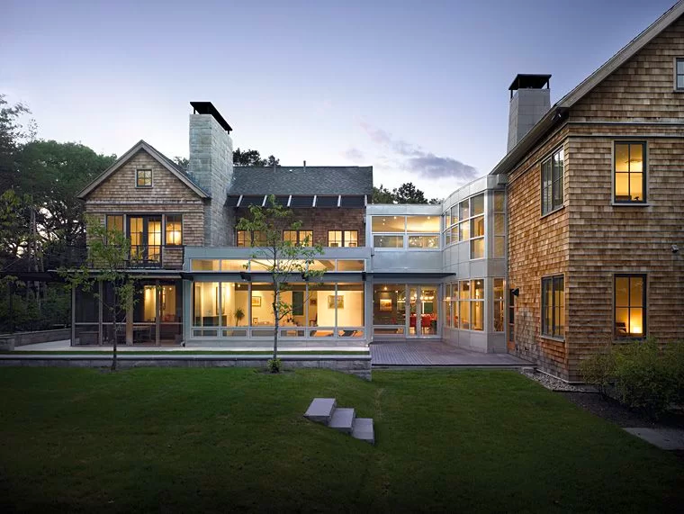
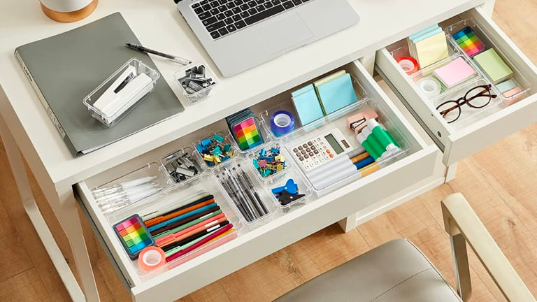

# Home is Where the Heart Is
I like to think of software engineering like a home. After all, if I'm going to be making a living out of it, I might as well make it as comfortable and as relaxing as possible.  
Something which holds true for both my home and software engineering, is that I am constantly adding more to what it means to me. Every new vacation, a picture hung on my wall. Every new project, an tool to be referred to in the future. Each one being a new experience for me to draw on in the future. 

## Home Design

Following the trend of important concepts in programming that saves a lot time and effort are design patterns. Design patterns are tried and true templates made over time by others which allows programmers to reuse code to suit their own purposes. 
Rather than attempting to figure out how to build each house from scratch, it is much easier to copy what was done to build other houses. Fortunately for architects and engineers, there is centuries worth of homes to choose from. However, much like how it is important to carefully choose a home design to fit the environment and region its being built in, it's also important to be choose a coding template to fit the demands of what the program needs to do. 
Haphazardly taking pieces of one home design and parts of another home design and slapping them together may get you a functional house, but the designs may clash with each other and prove problematic to make future renovations. This same principle holds true with design patterns in coding.  
Simply copy-pasting code that works for someone else may end up clashing with your own code and end up creating something called an anti-pattern. Anti-patterns are bits of problematic code, which while they may work at first after being made, but will inevitably need to be revisited to be fixed at a later date.  
As long as takes into consideration both their own code, and what they want to accomplish with the code, design patterns is an efficient and crucial part of any programmers kit.

## Keeping it Organized

Following the trend of important concepts in programming that saves a lot time and effort are coding standards. Coding standards are very much a love-hate relationship.  Coding standards are a set of rules and guidelines that programmers need to follow when coding so that their code can appear organized. Doing so will allow both the programmer and anyone else who views the code to have a better understanding what each line of code does. Keeping your drawers and folders in your home and office labeled and organized can seem like a chore in the moment, but it definitely saves time and effort later on when you're trying to find that important something. 
Unfortunately, following all the conventions of coding standards can seem inconvenient and tedious in the moment. If you attempt to use someone else's code, and they haven't followed the same standard you are using, it can be a great pain trying to go back and fix it to match the rest of your code. 
However, keeping up with coding standards is a good method of keeping an organized workspace, which is a guaranteed way to make ones life so much easier when working.

## I Love Programming
The best thing about coding, much like creating a home, is that there isn't a "wrong answer" to something that works, just maybe a better one. Everyone can have their own individualistic approach to programming, their own way to make a house their home. Creating unique code, a unique room, each with their own unique approach and set of problems to overcome. We all inevitably make mistakes, especially with programming, but adding that last line of code to your project, that last touch to your room, to complete it all, is one of the best feelings that I've experienced.
