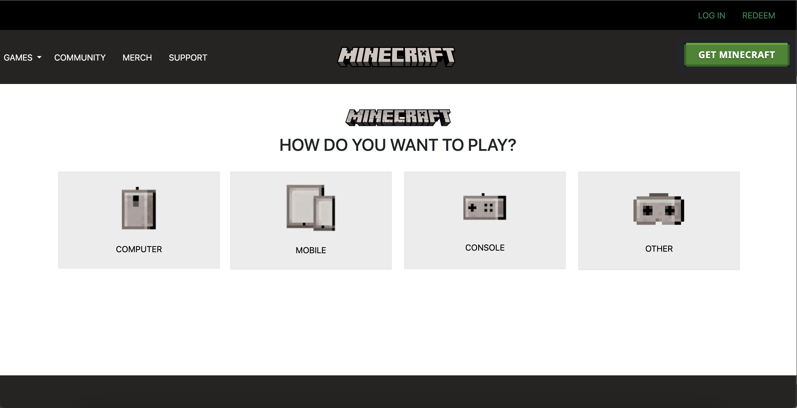

Creating websites can be extremely time consuming. This especially holds true when one is using raw HTML and CSS. Many of the formatting is very tedious and my take a lot of trial and error before one's website will begin to look good. Thus introducing UI Frameworks.

## Why UI Frameworks

Learning how to use UI Frameworks is almost like having to learn a new language, which means that there is a great deal of pain and confusion when you first start using it. Trying to create website using the UI Frameworks might make you wonder if it would be better to just use raw HTML and CSS. However, once you start to get ahold of how the classes work and really start to get into it, it'll be a lot harder to go back to the way you use to work. UI Frameworks is so much better because of the convenience it offers and the amount of time one can save is tremendous.

The image above is a simplified version of the <a href="https://www.minecraft.net/en-us/get-minecraft">Minecraft</a> download page which was made with bootstrap 5. Bootstrap 5 is great because it makes creating the rows and columns extremely easy, it's so easy that it makes it almost trivial. This is in comparison to raw HTML and CSS which is much more difficult and time consuming to create a column and row. In the end, while UI Frameworks may require some time and effort in order to learn how to use them, the results will save far more time than stubbornly sticking with raw HTML and CSS.