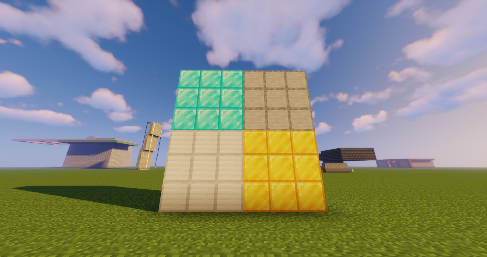
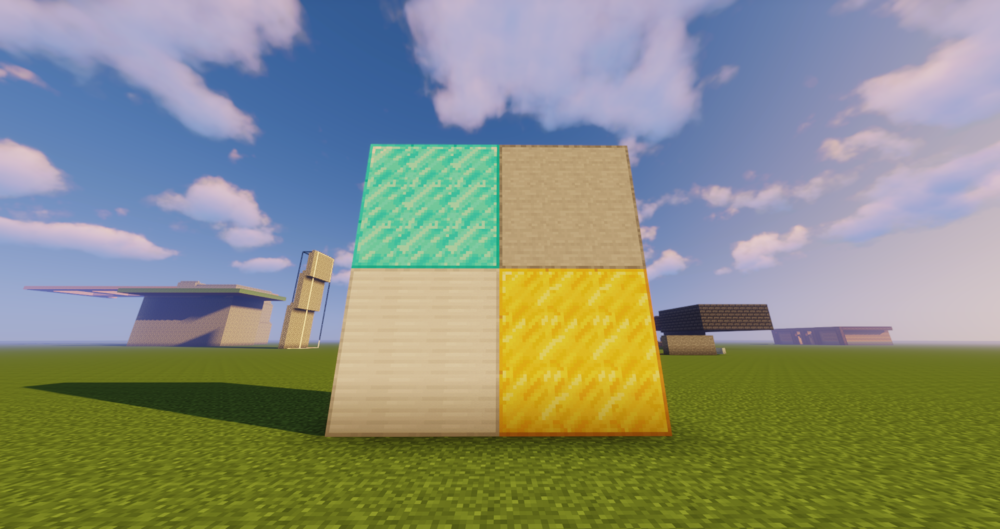

This was a personal project that I worked on with friends in our spare time. We took heavy inspiration through other popular resource packs that have been used, while adding our own personal tweaks to them to fit our personal tastes. There was a lot of time and effort put into it, and it's still being changed to this day. Everytime the game updates, we not only have to update the version of the resource pack to keep it compatible with the new version of minecraft, but we also have to add any new textures that were added to the game. Granted, we don't change every texture of the game, since there are many textures that we are more comfortable with and doesn't need any type of change. One of the features that we wanted to add to our resource pack was connected textures, where if 2 blocks of the same type are placed together, the textures would be seamless. An image of the feature can be seen below. The left image is the default textures while the right image is our custom one.

<div class="text-center p-4">
  
  
</div>

The coding for resource packs of minecraft is very minimal and simple. Most of the code is repetitive, simply going through every case that the texture may need to load. Most of the code that was written was to allow for a variety of textures for a single block. So not only did we have to write some code for each type of texture, but we also had to create each texture. More often than not, this would take time because while it may look good in the editor, it would look very different in game, causing us to redo the texture all over again. One of the sample codes that can be seen below allows for the textures of a birch log to be varied, this code specifically for the textures along the x-axis of the block. The rest of the code for this is the exact same, only it was for the y and z axis of the block.

```
   "variants": {
    "axis=x": [
      {
        "model": "block/birch/birch_log_horizontal",
        "x": 90,
        "y": 90
      },
      {
        "model": "block/birch/birch_log_horizontal_2",
        "weight": 3,
        "x": 90,
        "y": 90
      },
      {
        "model": "block/birch/birch_log_horizontal_3",
        "weight": 3,
        "x": 90,
        "y": 90
      },
      {
        "model": "block/birch/birch_log_horizontal_4",
        "weight": 3,
        "x": 90,
        "y": 90
      }
    ],
```
