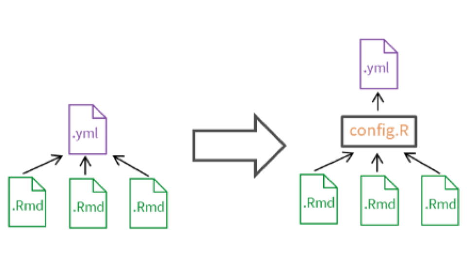

### Capstone Project: Contributions to Kaiaulu

**Timeline:** Aug - Dec 2024  
**Team Size:** 4 students  
**Tech Stack:** R, GitHub API, YAML, RMarkdown, GitHub Actions  
**Project Sponsors:** Carlos Paradis, Rick Kazman

**Overview:**  
[Kaiaulu](https://github.com/sailuh/kaiaulu) is an open-source R package for mining software repositories to analyze their characteristics by examining collaborative artifacts such as git logs, mailing lists, and files. As part of my university capstone, I contributed to extending Kaiaulu’s functionality and improving its modularity to make repository analysis more flexible and customizable.  

**My Contributions:**  
- **Refactoring & Structure:** Reorganized folder hierarchy and reconfigured project-level configuration files to improve modularity.  

  

 
- **Configuration Tools:** Implemented functionality to create standardized folder structures on users’ local devices.  
- **API Integration:** Extended usage of GitHub’s API endpoints, enabling richer data collection and analysis.  
- **Centralized Configuration Handling:** Streamlined the process of gathering details from project configuration (`.yml`) and decoupled notebooks (`.Rmd`) to reduce redundancy.  

**Quality Assurance:**    
- Ensured commits passed automated validation through GitHub Actions.  
- Participated in structured peer code reviews and sponsor-led pull request reviews to maintain code quality.  

**Sponsor Feedback:**  
> “The team performed an immense amount of high quality work throughout Kaiaulu codebase, not only in adding new features, but also refactoring major parts of Kaiaulu to more easily accommodate new changes. I appreciate the engagement, enthusiasm, and availability of the group in seeing the work through.”  
> – *Carlos, Project Sponsor*  

**Links:**  
- [Kaiaulu Repository](https://github.com/sailuh/kaiaulu)  
