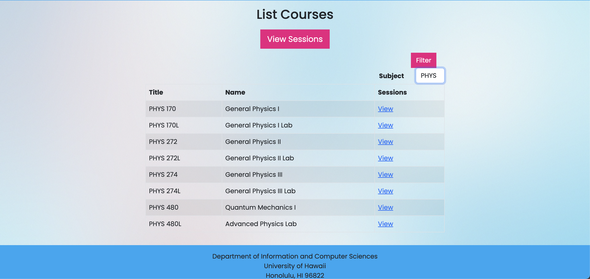

This was a team project that was completed with 4 other members in my ICS 314 class. Ohana Scholars is a website application designed to allow local students to be able to organize and find study sessions for courses from our home campus, University of Hawaii at Manoa.

Features which can be found in our applications are viewing courses and scheduling study sessions for those courses. Users can also view existing study sessions and sign up for them, adding their name to the session so that others can view who is currently interested in which study sessions. Additionally, there is a reputation system such that users can rate other students for their performance on a scale from 1 to 10.

    
    

My contributions to the web application include creating a collection on Mongo for the Courses. Each course object contained a subject, so that users would be able to filter the list of courses to view only the subjects that they needed to. That way, users wouldn't have to waste time scrolling through an extended table, viewing courses that they might not even be enrolled in. The pages also link directly to the sessions page, so that after confirming that the course they are interested in exists in the database, the user will be able to join or create a session for that course. In order to avoid any confusion in duplicate or possibly incorrect course data, only admins are able to add or edit any course information, which is located on a separate page only viewable by the admins.

For more information on the website application, click the link <a href="https://ohana-scholars.github.io"><strong>here</strong></a> to view our project home page. 
The running application can be viewed at <a href="https://ohanascholars.org">https://ohanascholars.org</a>.