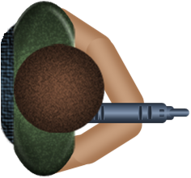
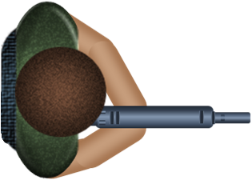
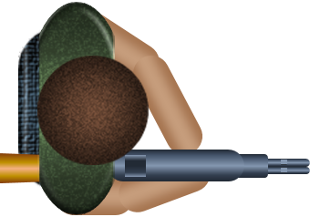

Xsiroy was a group project video game that I made in my freshman year of high school. The game was made using Construct 2, which used the HTML5 language. There were many improvements to this game when compared to the first video game that I made. For starters, this game was a much more complicated game, as it consisted of a total of three levels, as well as a start and end screen. The combat was more complex as well, as the player was able to access a larger variety of weapons and also had to fight more enemies on each level. To finish it off, I also created a boss at the final level that the player had to defeat. An example code below can be seen in controlling one of the simpler enemies in the game:

```
 <conditions>
    <condition id="0" name="On collision with another object" sid="912384551833634" type="Bullet2">
        <param id="0" name="Object">Enemy1</param>
    </condition>
    <condition id="-7" name="Compare instance variable" sid="312117402632281" type="Enemy1">
        <param id="0" name="Instance variable">Health</param>
        <param id="1" name="Comparison">4</param>
        <param id="2" name="Value">0</param>
    </condition>
 </conditions>
    <actions>
       <action id="-9" name="Destroy" sid="510488650559699" type="Bullet2" />
       <action id="-12" name="Subtract from" sid="444757803847030" type="Enemy1">
             <param id="0" name="Instance variable">Health</param>
             <param id="1" name="Value">1</param>
       </action>
       <action id="-22" name="Set angle toward position" sid="310445351874814" type="Enemy1">
             <param id="0" name="X">player.X-random(-25,25)</param>
             <param id="1" name="Y">player.Y-random(-25,25)</param>
        </action>
```

## The Game

  Xsiroy was a top down shooter game that consisted of 3 levels. The player would start with a pistol, and would have to fight through enemies to reach an elevator to move on to the next level. At the next level, they would unlock a new weapon and have a new objective before they could advance to the next level. The player would have to go around and activate generators in order to power the elevator so that they could move on. While the enemies would be more numerous, the player would also be able to discover health packs to increase their survivability. Once the player activates the elevator, they could move on to the final level. There, the player would unlock the third and final weapon, which they could use to fight the final boss. 
Below are the three player sprites:

<div class="text-center p-4">
  
  
  
</div>
  
## Challenges

  The most difficult part of this project was the restrictions placed upon us. We were using a free version of Construct 2, which limited not only the levels we could create but also the amount of code we could write. As such, many of our ideas and mechanics had to be scrapped in order to fit within the maximum lines of code. Another difficult part of the project was creating the sprites. My group members and I were not very artistic, so we had a hard time designing the sprites to use for our game (quite a few of them were simple geometric shapes in a single color). Unfortunately, most of the code for the game has been corrupted and it is not unplayable. Despite those troubles, it was a great deal of fun planning and creating this video game with my friends and classmates, and I will always look fondly upon this experience. 
